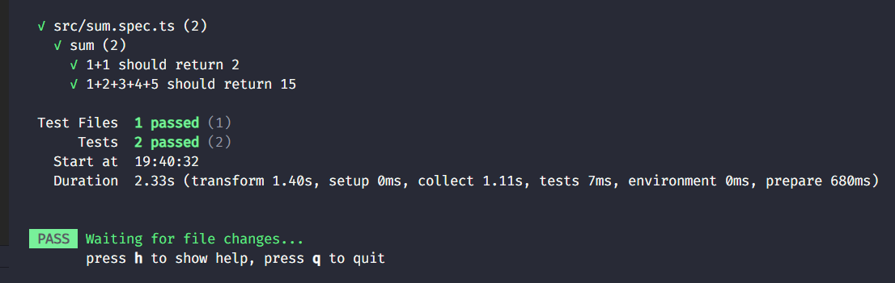
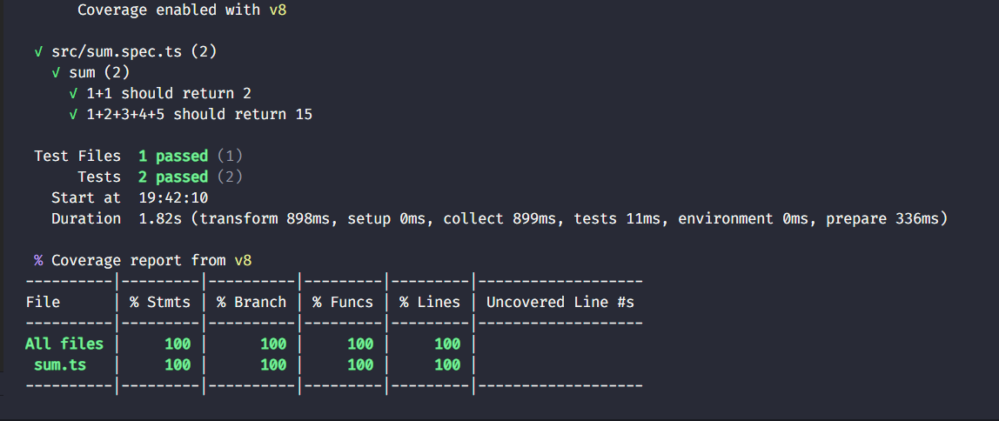
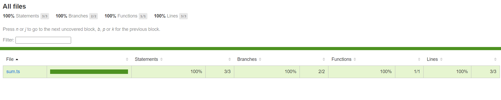

# Try Vitest

[vitest]: https://vitest.dev/

https://vitest.dev/

Quickly trying out [vitest][vitest] for the very first time with the **minimal setup**. Vitest is a unit testing framework similar to [Jest](https://jestjs.io/)

## Getting Started

1. `npm init -y`
2. `npm i -D typescript`
3. `tsc --init`
4. `npm i -D vitest`
5. Update `package.json`

```json
{
  "scripts": {
    "start": "node src/index.ts",
    "test": "vitest",
    "test:cov": "vitest run --coverage"
  }
}
```

### `sum.ts`

```ts
export function sum(...numbers: number[]): number {
  return numbers.reduce((a, b) => a + b, 0);
}
```

### `sum.spec.ts`

```ts
import { describe, it, expect } from 'vitest';
import { sum } from './sum';

describe('sum', () => {
  it('1+1 should return 2', () => {
    expect(sum(1, 1)).toEqual(2);
  });
  it('1+2+3+4+5 should return 15', () => {
    expect(sum(1, 2, 3, 4)).toEqual(10);
  });
});
```

## Running tests

```bash
npm test
```

**OUTPUT**

```bash

 DEV  v1.4.0 path/to/try-vitetest

 ✓ src/sum.spec.ts (2)
   ✓ sum (2)
     ✓ 1+1 should return 2
     ✓ 1+2+3+4+5 should return 15

 Test Files  1 passed (1)
      Tests  2 passed (2)
   Start at  19:40:32
   Duration  2.33s (transform 1.40s, setup 0ms, collect 1.11s, tests 7ms, environment 0ms, prepare 680ms)


 PASS  Waiting for file changes...
       press h to show help, press q to quit
```



### Running tests with coverage

```bash
npm run test:cov
# vitest run --coverage
```

Running this command for the first time will prompt you to install a dependency.
When confirmed, then it should automatically install the following package: `@vitest/coverage-v8`

**OUTPUT**

```bash
 RUN  v1.4.0 path/to/try-vitetest
      Coverage enabled with v8

 ✓ src/sum.spec.ts (2)
   ✓ sum (2)
     ✓ 1+1 should return 2
     ✓ 1+2+3+4+5 should return 15

 Test Files  1 passed (1)
      Tests  2 passed (2)
   Start at  19:42:10
   Duration  1.82s (transform 898ms, setup 0ms, collect 899ms, tests 11ms, environment 0ms, prepare 336ms)

 % Coverage report from v8
----------|---------|----------|---------|---------|-------------------
File      | % Stmts | % Branch | % Funcs | % Lines | Uncovered Line #s
----------|---------|----------|---------|---------|-------------------
All files |     100 |      100 |     100 |     100 |
 sum.ts   |     100 |      100 |     100 |     100 |
----------|---------|----------|---------|---------|-------------------
```




